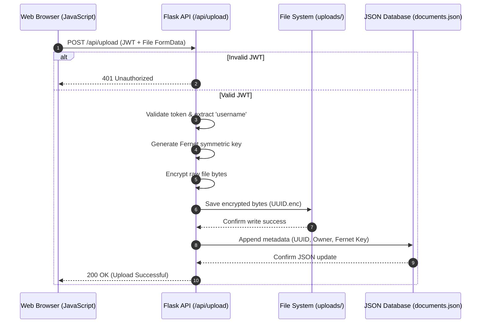

```mermaid
sequenceDiagram
    autonumber
    participant Client as Web Browser (JavaScript)
    participant Server as Flask API (/api/upload)
    participant Disk as File System (uploads/)
    participant DB as JSON Database (documents.json)

    Client->>Server: POST /api/upload (JWT + File FormData)
    
    alt Invalid JWT
        Server-->>Client: 401 Unauthorized
    else Valid JWT
        Server->>Server: Validate token & extract 'username'
        Server->>Server: Generate Fernet symmetric key
        Server->>Server: Encrypt raw file bytes
        Server->>Disk: Save encrypted bytes (UUID.enc)
        Disk-->>Server: Confirm write success
        Server->>DB: Append metadata (UUID, Owner, Fernet Key)
        DB-->>Server: Confirm JSON update
        Server-->>Client: 200 OK (Upload Successful)
    end
```