# Penetration Testing Report

**Tester:** Weston Lane, Oli King  
**Target Application:** Secure File Sharing Site  

---

## A. Authentication Testing

### A.1. Brute Force Protection
* **Status:** [ X ] Pass | [ ] Fail | [ ] Pending
* **Steps Taken:**
  1. Created test account to lockout
  2. submitted 4 login requests all incorrect passwords recieving a 401 error
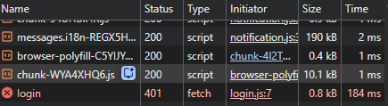
3. After 5th incorrect attempt, each successive attempt lockouts the account, sends a 403 error, and logs in the security log
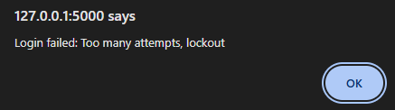
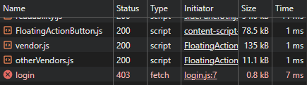
```json
{"timestamp": "2026-04-18T21:00:38.366203+00:00", "severity": "CRITICAL", "event_type": "ACCOUNT_LOCKOUT", "user_id": "bruteTest", "ip_address": "127.0.0.1", "user_agent": "Mozilla/5.0 (Windows NT 10.0; Win64; x64) AppleWebKit/537.36 (KHTML, like Gecko) Chrome/146.0.0.0 Safari/537.36", "details": {"failed_attempts": 5, "lockout_duration_seconds": 900}}
```
* **Expected Outcome:** 
[Account locks out after 5 failed attempts]
* **Actual Outcome:** 
[Account Locks all events logged]
* **Remediation / Notes:** 
Successfully implements the lockout mechanism. Enforcing a 15 in cooldown after 5 failed attempts. logs a CRITICAL severity

### A.1-1 Brute Force Rate Limiter
* **Status:** [ X ] Pass | [ ] Fail | [ ] Pending
* **Steps Taken:**
  1. using flasks rate limit API we block the login endpoint using a decorator to check for many login attempts from 1 IP
  2. use test_ratelimit.py to request "https://127.0.0.1:5000/api/login"
  15 times
  3. after 10th in a minute the server with send a 429 error and log the attempts
  ```json
  {"timestamp": "2026-04-18T21:51:44.489219+00:00", "severity": "WARNING", "event_type": "RATE_LIMIT_EXCEEDED", "user_id": "ANONYMOUS", "ip_address": "127.0.0.1", "user_agent": "python-requests/2.33.1", "details": {"endpoint": "/api/login", "limit_hit": "10 per 1 minute", "method": "POST"}}
  ```

* **Expected Outcome:** 
recieve a 429 error from server and log output
* **Actual Outcome:** 
recieves a 429 error from server and logged output
* **Remediation / Notes:** 

### A.2. Password Complexity Enforcement
* **Status:** 
[ X ] Pass | [ ] Fail | [ ] Pending
* **Steps Taken:**
    1. Navigated to the /api/register endpoint.

    2. Attempted to create an account with a password that was too short (Pass!1).

    3. Attempted to create an account with a 12-character password missing a special character (Password12345).

    4. Attempted to create an account with a 12-character password missing a number (Password!!!!!).

    5. Verified the server response for each invalid attempt.

    6. Registered a valid user with a password meeting all criteria (SecurePass!1234) to confirm the "Pass" case
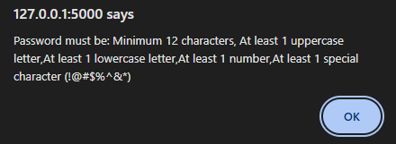
* **Expected Outcome:** 
Server rejects any password that does not meet the 12 char, one upper, one number, and one special char requirement
    *rejects return a 400 Bad Request

* **Actual Outcome:** 
Succesfully blocked invalid passwords and allowed sufficiently complex ones
    *returns a 200 OK status and logged
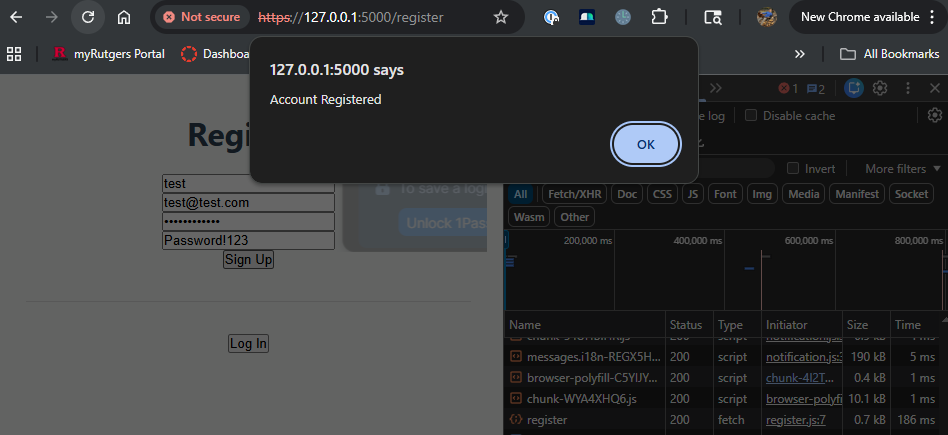

```json
{"timestamp": "2026-04-18T22:10:55.492061+00:00", "severity": "INFO", "event_type": "ACCOUNT_CREATION", "user_id": "test", "ip_address": "127.0.0.1", "user_agent": "Mozilla/5.0 (Windows NT 10.0; Win64; x64) AppleWebKit/537.36 (KHTML, like Gecko) Chrome/146.0.0.0 Safari/537.36", "details": {"email": "test@test.com", "assigned_role": "user"}}
```
* **Remediation / Notes:**

### A.3. Session Management
* **Status:** 
[ X ] Pass | [ ] Fail | [ ] Pending
* **Steps Taken:**
  1. Authernticated app
  2. inspected session_token via the browser dev tools
    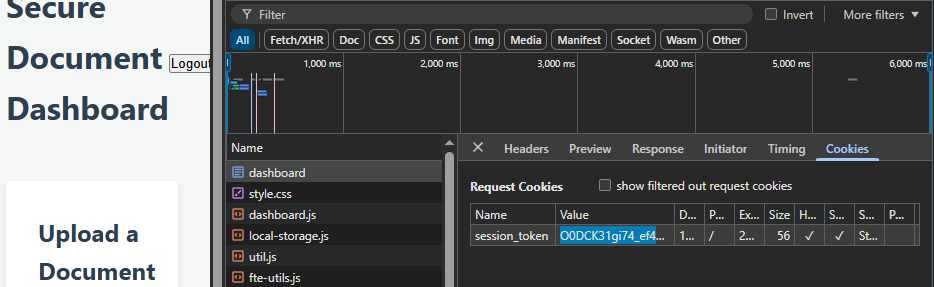
  3. Ensured Cookie headers
    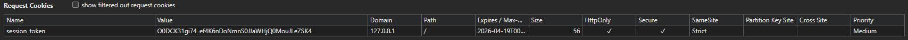
  4. Ensure that a session was created in the json file and that user data is stored server side and not given to client
    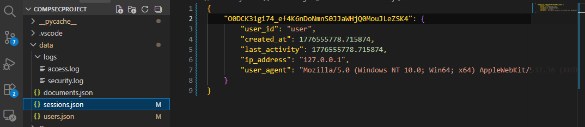

* **Expected Outcome:** 
The session token must be cryptographically secure and unguessable. The browser cookie must enforce HttpOnly, Secure, and SameSite=Strict flags to prevent client-side script access and cross-origin transmissio
* **Actual Outcome:** 
The application successfully generated a 32-byte URL-safe token. The browser Developer Tools confirmed all required security flags (HttpOnly, Secure, SameSite=Strict) were active. Server-side inspection confirmed data isolation.
* **Remediation / Notes:** 
The implementation of server-side opaque tokens effectively neutralizes token decoding and manipulation attacks. The enforcement of HttpOnly prevents session hijacking via Cross-Site Scripting (XSS), while SameSite=Strict mitigates Cross-Site Request Forgery (CSRF)
### A.4. Logout Functionality
* **Status:** 
[ X ] Pass | [ ] Fail | [ ] Pending
* **Steps Taken:**
  1. Login
  2. Logout and check if session was closed in JSON
  3. Ensure that the session token was destroyed upon logout
    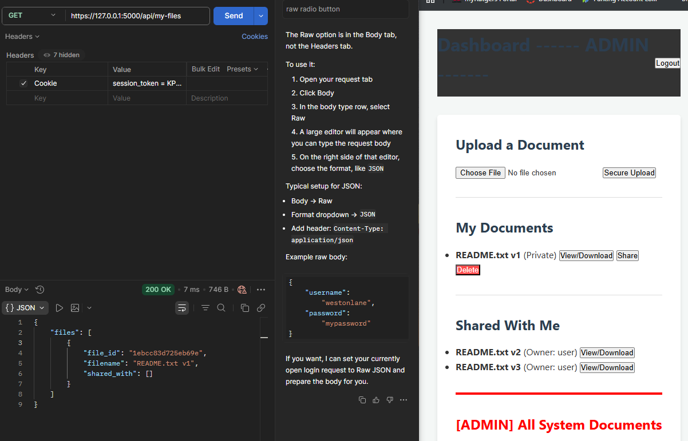
    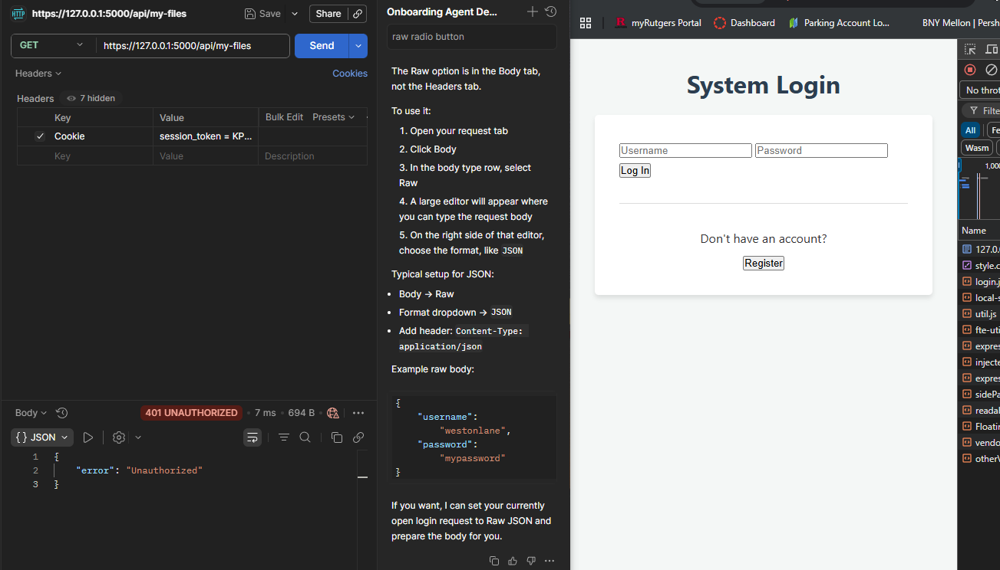
* **Expected Outcome:**
    The server must instruct the client to remove the session cookie.
  * The server must actively destroy the session token in the backend storage (memory/database).
  * Subsequent requests using the terminated token must be rejected with a `401 Unauthorized` status.
* **Actual Outcome:** 
    The browser successfully cleared the cookie. 
  * Reusing the old token in Postman resulted in a `401 Unauthorized` response, confirming server-side invalidation. 
  * The `LOGOUT_SUCCESS` event was recorded in the security logs.
  ```json
  {"timestamp": "2026-04-19T00:23:21.716914+00:00", "severity": "INFO", "event_type": "LOGOUT_SUCCESS", "user_id": "admin", "ip_address": "127.0.0.1", "user_agent": "Mozilla/5.0 (Windows NT 10.0; Win64; x64) AppleWebKit/537.36 (KHTML, like Gecko) Chrome/146.0.0.0 Safari/537.36", "details": {"message": "User actively logged out."}}
  ```
* **Remediation / Notes:**
The application correctly implements stateful, server-side session termination. By destroying the token via the `SessionManager` singleton rather than relying solely on client-side cookie deletion, the system is protected against post-logout session replay attacks.
### A.5. Password Reset Security
* **Status:** 
[ ] Pass | [ ] Fail | [ ] Pending
* **Steps Taken:**
  1. 
* **Expected Outcome:**

* **Actual Outcome:** 

* **Remediation / Notes:** ---

## B. Authorization Testing

### B.1. Horizontal Privilege Escalation
* **Status:** [ ] Pass | [ X ] Fail | [ ] Pending
* **Steps Taken:**
  1. Identified an existing `file_id` (`9ca2f877efc3605c`) in the database belonging to another user.
  2. Authenticated into the application as a standard user (`user2`) to obtain a valid session token.
  3. Sent a `DELETE` request to `/api/delete/9ca2f877efc3605c` using `user2`'s session token.
* **Expected Outcome:** * The application must enforce strict resource isolation based on ownership.
  * Attempts to delete a resource owned by another user on the same privilege tier must be rejected with a `403 Forbidden` status.
* **Actual Outcome:** * The server incorrectly processed the unauthorized request, returning a `200 OK` and `{"message": "Document deleted successfully"}`.
  * The file was successfully deleted from the system by an unauthorized user.
* **Remediation / Notes:** **CRITICAL VULNERABILITY (IDOR).** The application suffers from a Broken Access Control vulnerability on the /api/delete/ endpoint. While the data layer correctly evaluates authorization and returns an "UNAUTHORIZED" string, the API routing layer evaluates this non-empty string as a boolean True. This causes the API to bypass the 403 Forbidden safeguard and execute the physical file deletion. The endpoint was patched to explicitly evaluate the string constants ("DELETED_ALL", "REMOVED_SHARE", "UNAUTHORIZED") to properly route the logic and preserve file integrity for shared documents.
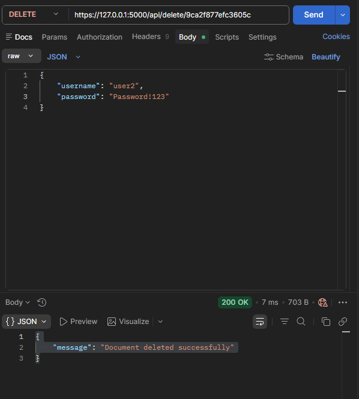
* **Updated Status:** [ X ] Pass | [ ] Fail | [ ] Pending
SOLVED
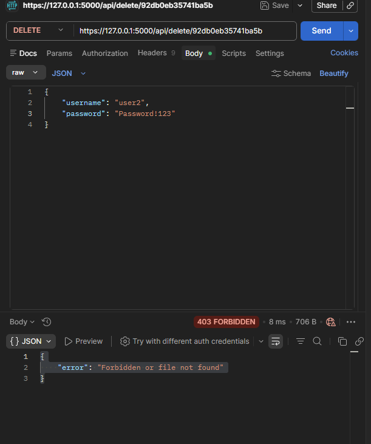

### B.2. Vertical Privilege Escalation
* **Status:** [ X ] Pass | [ ] Fail | [ ] Pending
* **Steps Taken:**
  1. Authenticated into the application as a standard, non-administrative user to obtain a valid session token.
  2. Attempted to access restricted administrative endpoints, specifically executing a `GET` request to `/api/admin/users` and a `POST` request to `/api/admin/update-role`.
  3. Ensured the standard user's session token was included in the `Cookie` header for both requests.
* **Expected Outcome:** * The application must enforce Role-Based Access Control (RBAC) on all administrative endpoints.
  * Any request originating from an account without the explicitly required `admin` role must be rejected with a `403 Forbidden` status code, regardless of authentication state.
* **Actual Outcome:** * The server successfully rejected the requests, returning a `403 Forbidden` status for both the GET and POST attempts.
  * The system prevented the standard user from viewing the user list or modifying role configurations.
  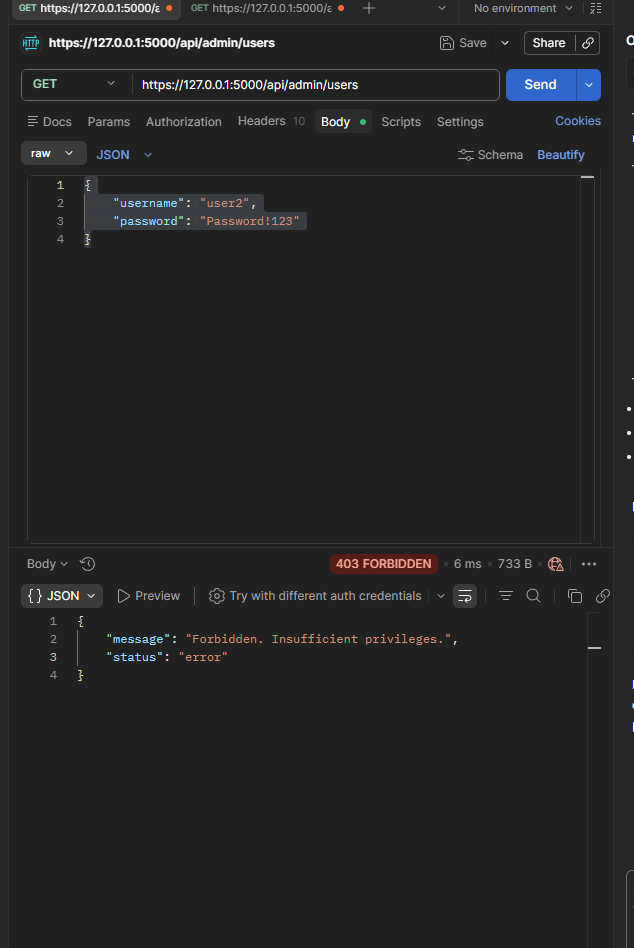
  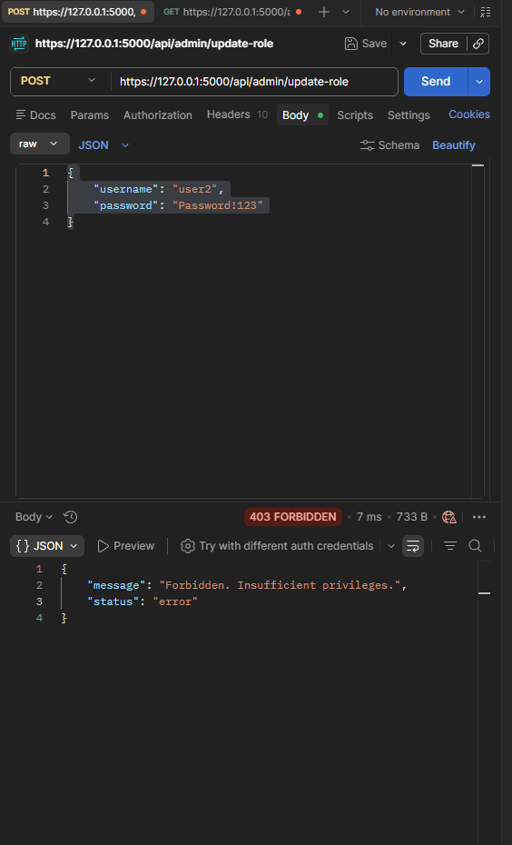
* **Remediation / Notes:** The application effectively mitigates vertical privilege escalation. The implementation of the `@require_roles('admin')` decorator ensures that authorization checks are performed systematically before the routing logic executes. This strict RBAC implementation prevents standard users from accessing sensitive administrative metadata or altering system configurations.

### B.3. Insecure Direct Object Reference (IDOR)
* **Status:** [ X ] Pass | [ ] Fail | [ ] Pending
* **Steps Taken:**
  1. Extracted a valid `file_id` from the database that was explicitly owned by the `admin` account.
  2. Authenticated as a standard, unprivileged user to obtain a valid session token.
  3. Attempted a direct object reference attack by sending a `GET` request to `/api/view/<file_id>` and `/api/download/<file_id>` using the admin's file ID but the standard user's session token.
* **Expected Outcome:** * The application must not rely solely on the unguessability of the `file_id` (Security by Obscurity).
  * The backend must validate the authenticated user's authorization against the requested object's metadata. 
  * Unauthorized direct access attempts must be blocked with a `403 Forbidden` status.
* **Actual Outcome:** * The server successfully validated the object reference against the user's role and ownership status.
  * The request was rejected with a `403 Forbidden` error, and the attempt was logged as an `AUTHORIZATION_FAILURE`.
  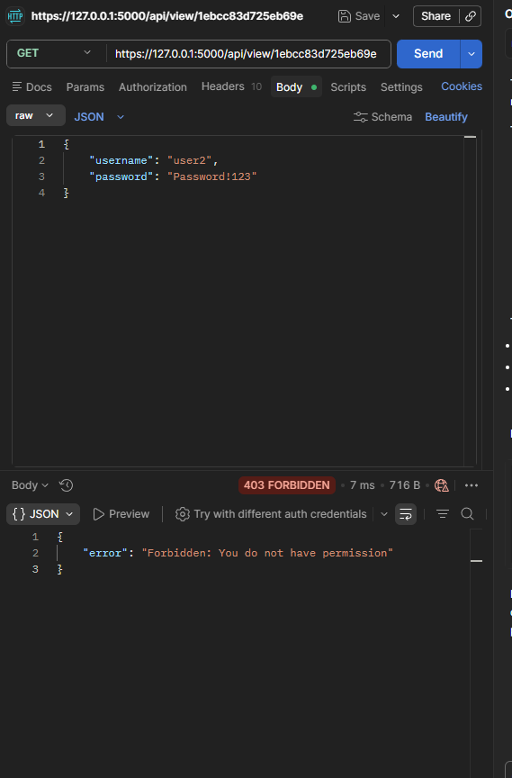

  * **Remediation / Notes:** The application effectively mitigates IDOR vulnerabilities on its read endpoints. By extracting the object metadata via `db.GetDocument(file_id)` and strictly verifying that `g.user_id` matches the `owner_id` or exists within the `shared_with` array before decryption, the system ensures strong object-level access control.
### B.3-1 IDOR via POST Payload (State Modification)
* **Status:** [ X ] Pass | [ ] Fail | [ ] Pending
* **Steps Taken:**
  1. Identified a target `file_id` owned by the `admin` account.
  2. Authenticated as a standard user to obtain a valid session token.
  3. Sent a POST request to `/api/share` using the standard user's session token.
  4. Injected the admin's `file_id` into the JSON body: `{"file_id": "<ADMIN_FILE_ID>", "target_user": "guest"}`.
* **Expected Outcome:** The application must validate ownership of the `file_id` on the server side before modifying its access control list. The request should be rejected with a `403 Forbidden` status.
* **Actual Outcome:** The server successfully validated the object ownership and rejected the unauthorized modification attempt. A 403 Forbidden error was returned with the message "Failed to share. Check permissions."
* **Remediation / Notes:** The application effectively mitigates IDOR vulnerabilities on state-modifying endpoints like /api/share. By strictly evaluating the success boolean returned by db.ShareDocument (which correctly evaluates authorization logic), the API prevents unauthorized users from altering the Access Control List (ACL) of objects they do not own
  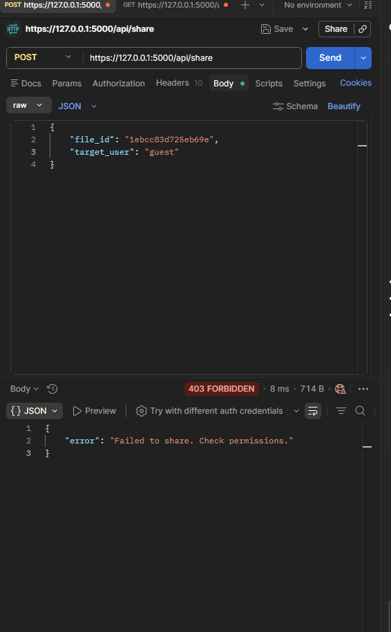
 

### B.4. Forced Browsing (Unauthenticated URL Access)
* **Status:** [ X ] Pass | [ ] Fail | [ ] Pending
* **Steps Taken:**
  1. Cleared all active session tokens to simulate an unauthenticated, anonymous attacker.
  2. Attempted to directly access protected user interface routes via `GET /dashboard` and `GET /admin` and all other endpoints
  3. Attempted to directly access the protected API route `GET /api/my-files` without an active session.
* **Expected Outcome:** * The application must not rely on hiding links from the UI as a security measure.
  * Every protected route must independently verify authentication state before processing the request or rendering the template.
  * Unauthenticated direct access attempts must be rejected with a `401 Unauthorized` status or redirected to the login page.
* **Actual Outcome:** * The server successfully intercepted the direct URL access attempts. 
  * The API routes returned a `401 Unauthorized` status, and the UI routes correctly denied access.
  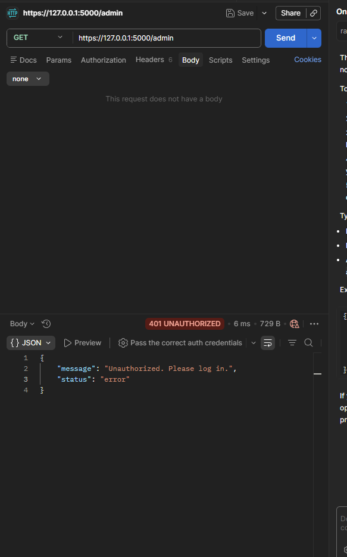
* **Remediation / Notes:** The application effectively defends against forced browsing. The implementation of the `before_request` hook combined with the `@login_required` decorator ensures a unified, "default-deny" security posture across all sensitive routes. This architectural pattern guarantees that no endpoint can be accidentally exposed to anonymous users.

## C. Input Validation Testing

### C.1. Cross-Site Scripting (XSS) & Input Validation
* **Status:** [ X ] Pass | [ ] Fail | [ ] Pending
* **Steps Taken:**
  1. (Stored XSS): Uploaded a file with a malicious name: `<script>alert('XSS')</script>.txt` and navigated to the file list to ensure the payload was not executed by the browser.
  2. (Input Validation XSS): Authenticated as a standard user and sent a POST request to `/api/share`.
  3. Injected a standard XSS payload into the JSON body: `{"file_id": "<VALID_ID>", "target_user": "<script>alert(1)</script>"}`.
* **Expected Outcome:** * The application must sanitize all stored inputs before rendering them to the client to prevent Stored XSS.
  * The application must enforce strict allow-list Input Validation (Regex) on all API parameters to reject malicious characters (e.g., `<`, `>`, `/`).
  * Invalid inputs must be rejected with a `400 Bad Request` status.
* **Actual Outcome:** * The malicious filename was safely rendered as escaped text (e.g., `scriptalertXSS_script.txt`).
    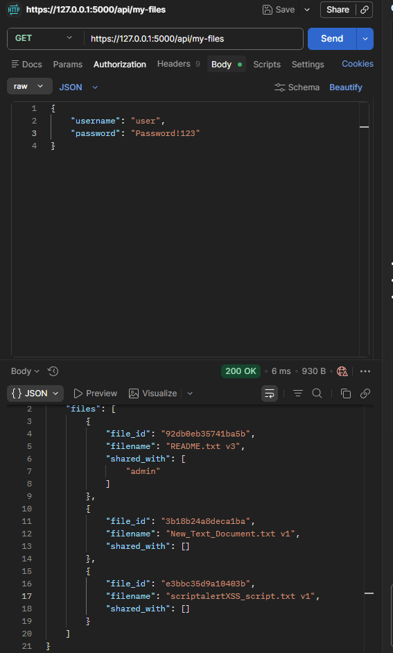
  * The `/api/share` endpoint intercepted the payload and returned a `400 Bad Request` with "Invalid username format".
  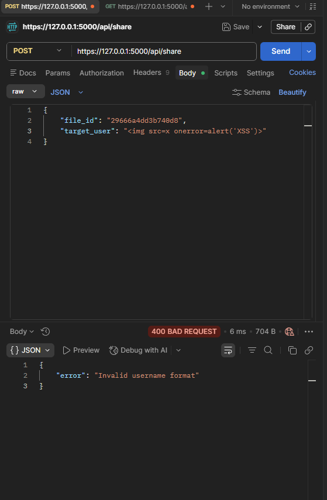
  * The system correctly logged an `INPUT_VALIDATION_FAILURE` event.
* **Remediation / Notes:** The application utilizes a strong defense-in-depth approach to XSS. It implements strict Regex input validation (`^[a-zA-Z0-9_]{3,20}$`) at the API boundary to drop malicious payloads, while simultaneously utilizing context-aware output encoding (`html.escape`) to neutralize any payloads that might bypass the initial filters.

### C.1c. Reflected XSS (URL-Based)
* **Status:** [ X ] Pass | [ ] Fail | [ ] Pending
* **Steps Taken:**
  1. Authenticated into the web application via a standard web browser (Chrome/Firefox).
  2. Identified URL-based input vectors (query parameters and the 404 error handler).
  3. Injected a breakout XSS payload (`">`) directly into the URL address bar.
  4. Submitted the request to observe if the browser executed the reflected payload.
* **Expected Outcome:** * The application must utilize context-aware output encoding when reflecting user-supplied URL data back to the browser.
  * The payload must be rendered as text or encoded entities, preventing client-side execution.
* **Actual Outcome:** 
    Pop up was blocked resulting in a 404 and no alert message from browser
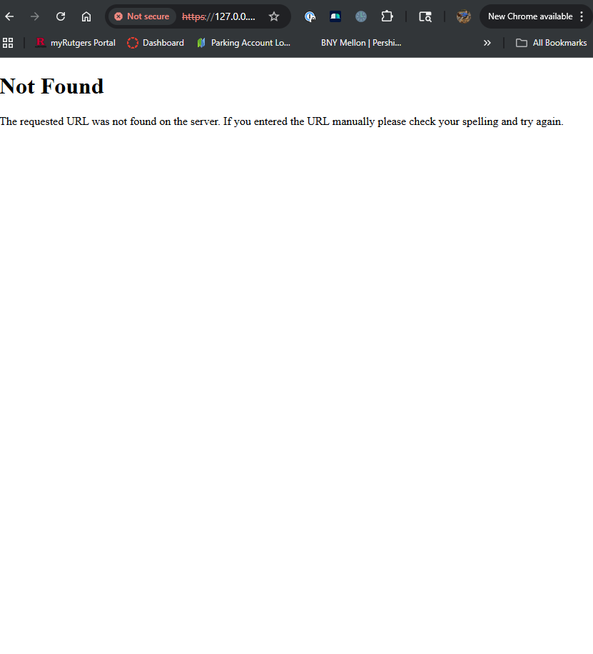
* **Remediation / Notes:** 

### C.2. Path / Directory Traversal
* **Status:** [ X ] Pass | [ ] Fail | [ ] Pending
* **Steps Taken:**
  1. Authenticated into the application to obtain a valid session token.
  2. Attempted to read underlying Report Image Files by injecting directory traversal sequences (`../` and `..\`) into the `/api/download/` and `/api/view/` endpoints.
  3. Verified upload path traversal mitigations during the XSS testing phase due to the stripping of file names.
* **Expected Outcome:** * The application must never concatenate user input directly into file system paths without rigorous validation.
  * Attempts to navigate outside the designated application directories using relative paths must be blocked or result in a safely handled error.
* **Actual Outcome:** * The server safely rejected the traversal payloads, returning a standard error (`404 Not Found` or `403 Forbidden`). 
  * The underlying host operating system files were successfully protected.
* **Remediation / Notes:** The application effectively nullifies Path Traversal vulnerabilities through its architectural design. By implementing an Indirect Object Reference pattern (using randomly generated hexadecimal `file_id` tokens as database keys rather than raw filenames), user input is heavily decoupled from OS-level file operations. Any traversal payload simply fails the initial database lookup, neutralizing the attack before file system interaction occurs. Furthermore, standard filename sanitization ensures malicious paths cannot be written during file uploads.

### C.3 OS Command Injection
* **Status:** [ X ] Pass | [ ] Fail | [ ] Pending
* **Steps Taken:**
  1. Conducted source code review of `app.py` and `DataBase.py` to identify  system execution calls.
  2. Searched the codebase for instances of `os.system()`, `os.popen()`, `subprocess.Popen(shell=True)`, and `eval()`.
  3. Analyzed the backend file deletion logic (`os.remove()`) to ensure it uses Python API calls rather than executing shell commands.
* **Expected Outcome:** * The application must not pass unsanitized user input to the operating system shell.
  * System-level operations must be handled by native language APIs that cannot be subverted to execute arbitrary binaries.
* **Actual Outcome:** * The code review confirmed that the application completely avoids executing OS-level shell commands. 
  * All file system interactions are handled strictly through Python's `os` and `shutil` modules, which treat inputs as literal file paths, not executable commands.
* **Remediation / Notes:** The application is intrinsically secure against OS Command Injection due architectural design. By utilizing native Python APIs for file operations and avoiding system shell delegations the attack surface for command injection is eliminated.

### C.4 Unrestricted File Upload (Type Validation)
* **Status:** [ X ] Pass | [ ] Fail | [ ] Pending
* **Steps Taken:**
  1. Authenticated as a standard user.
  2. Attempted to upload files with explicitly dangerous extensions (`.py`, `.exe`, `.html`) via the `/api/upload` endpoint.
* **Expected Outcome:** The application must enforce strict allow-list validation on file extensions and reject executable or unsupported file types with a `400` or `415` error.
* **Actual Outcome:** 
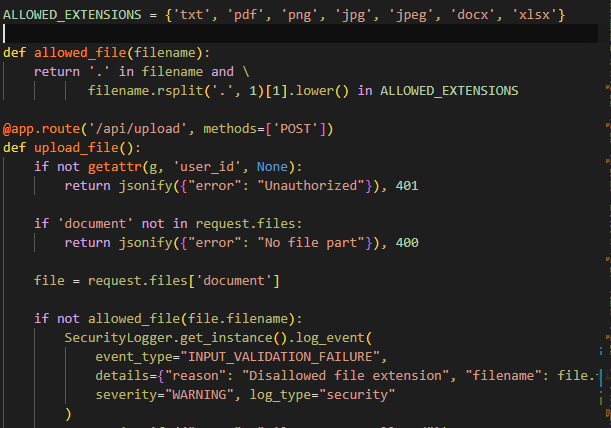
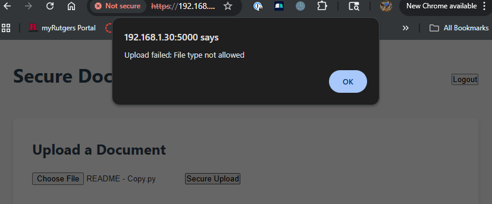
* **Remediation / Notes:** 

### C.2-1 Resource Exhaustion (File Size Limits)
* **Status:** [ X ] Pass | [ ] Fail | [ ] Pending
* **Steps Taken:**
  1. Authenticated as a standard user.
  2. Attempted to upload a file exceeding reasonable document size constraints (e.g., >16MB) to test server resource limits.
* **Expected Outcome:** The application must enforce a maximum content length (e.g., `MAX_CONTENT_LENGTH`) to prevent Denial of Service (DoS) via disk exhaustion, returning a `413 Payload Too Large` error.
* **Actual Outcome:** 
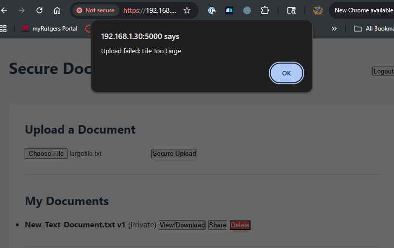
* **Remediation / Notes:**

### C.2-2 MIME type and Magic Btye Impl
* **Status:** [ X ] Pass | [ ] Fail | [ ] Pending
* **Steps Taken:**
  1. Authenticated as a standard user.
  2. Attempted to upload a file changing extension from blocked type to allowed
* **Expected Outcome:** The application must enforce a 400 "spoofed file detected" error
* **Actual Outcome:** 
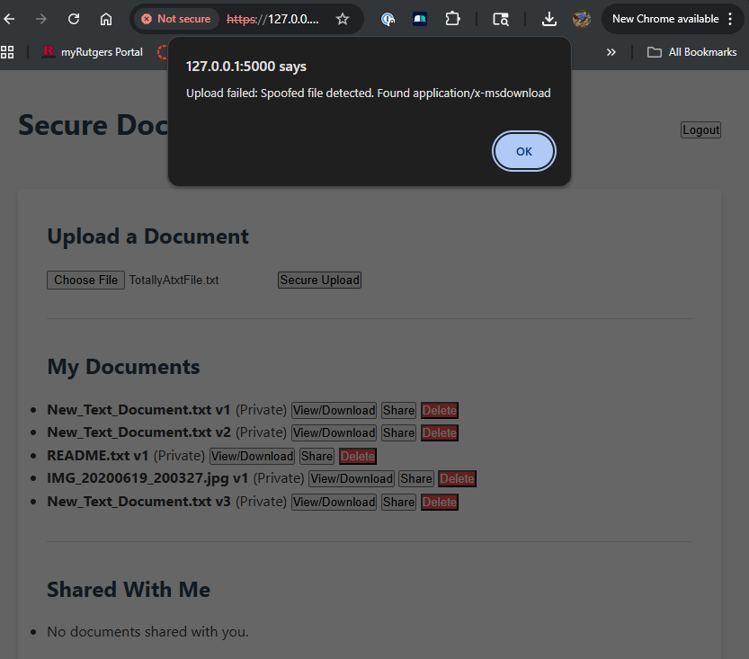
* **Remediation / Notes:**

## D. Session Security Testing

### D.1. Session Fixation
* **Status:** [ X ] Pass | [ ] Fail | [ ] Pending
* **Steps Taken:**
  1. Configured a Postman `POST` request to the `/api/login` endpoint with valid user credentials.
  2. Injected a predetermined, artificial session identifier into the request headers (`Cookie: session_token=tjJwwHBWC4146y-11ARBhwd0l_tTedo-vYqTLlu_8s8`).
  3. Executed the login request and analyzed the `Set-Cookie` response headers.
* **Expected Outcome:** The application must invalidate any pre-authentication session identifiers. Upon successful authentication, the server must generate and issue a completely new, cryptographically secure session token.
* **Actual Outcome:** The application issues a new token on each login and does not use the attackers token
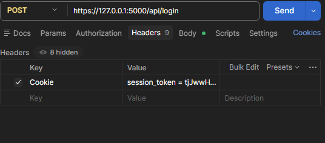
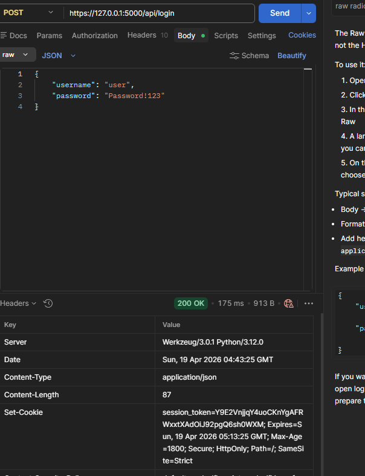
* **Remediation / Notes:**

### D.2. Session Hijacking
* **Status:** 
[ ] Pass | [ ] Fail | [ ] Pending
* **Steps Taken:**
  1. 
* **Expected Outcome:** 
* **Actual Outcome:** 
* **Remediation / Notes:** 
### D.3. Concurrent Session Handling
* **Status:** 
[ ] Pass | [ ] Fail | [ ] Pending
* **Steps Taken:**
  1. 
* **Expected Outcome:** 
* **Actual Outcome:** 
* **Remediation / Notes:** 
### D.4. Session Timeout
* **Status:** 
[ ] Pass | [ ] Fail | [ ] Pending
* **Steps Taken:**
  1. 
* **Expected Outcome:** 
* **Actual Outcome:** 
* **Remediation / Notes:** ---

## E. Configuration Testing

### E.1. Security Headers
* **Status:** 
[ ] Pass | [ ] Fail | [ ] Pending
* **Steps Taken:**
  1. 
* **Expected Outcome:** 
* **Actual Outcome:** 
* **Remediation / Notes:** 
### E.2. TLS/SSL Configuration
* **Status:** 
[ ] Pass | [ ] Fail | [ ] Pending
* **Steps Taken:**
  1. 
* **Expected Outcome:** 
* **Actual Outcome:** 
* **Remediation / Notes:** 
### E.3. Error Handling
* **Status:** 
[ ] Pass | [ ] Fail | [ ] Pending
* **Steps Taken:**
  1. 
* **Expected Outcome:** 
* **Actual Outcome:** 
* **Remediation / Notes:** 
### E.4. Debug Mode Disabled
* **Status:** 
[ ] Pass | [ ] Fail | [ ] Pending
* **Steps Taken:**
  1. 
* **Expected Outcome:** 
* **Actual Outcome:** 
* **Remediation / Notes:** `